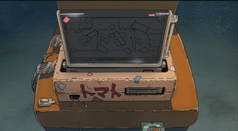

<div align="center">
  <h1>Relayer</h1>



[](https://www.repostatus.org/#active)

[](https://godoc.org/github.com/cosmos/relayer)
[](https://goreportcard.com/report/github.com/cosmos/relayer)
[](https://github.com/cosmos/relayer/blob/main/LICENSE)
[](https://github.com/cosmos/relayer)
[](https://github.com/cosmos/relayer/latest)
[](https://codecov.io/gh/icon-project/ibc-relay)
</div>

---

This repo is a fork of cosmos [relayer](https://github.com/cosmos/relayer). The goal of this project is to relay packets between ICON and Wasm chains by following the IBC Specs. 
1. [What is ICON-IBC Integration](https://github.com/icon-project/IBC-Integration)
2. [Deviations from Cosmos Relayer](./docs/deviations_from_ibc.md)
---


In IBC, blockchains do not directly pass messages to each other over the network. This is where `relayer` comes in. 
A relayer process monitors for updates on opens paths between sets of [IBC](https://ibcprotocol.org/) enabled chains.
The relayer submits these updates in the form of specific message types to the counterparty chain. Clients are then used to 
track and verify the consensus state.

In addition to relaying packets, this relayer can open paths across chains, thus creating clients, connections and channels.

Additional information on how IBC works can be found [here](https://ibc.cosmos.network/).

---

## Demo
- The easiest way would be to follow the guide in [this repo](https://github.com/izyak/icon-ibc/tree/master) to setup relay for icon ibc integration. It has all the relevant scripts setup, and you can start the relay using a single command.
- There is E2E tests demo for icon ibc integration [here](https://github.com/icon-project/IBC-Integration/blob/main/docs/e2e_test_setup.md)
---

## Table Of Contents
- [Basic Usage - Relaying Across Chains](#basic-usage---relaying-packets-across-chains)
- [Create Path Across Chains](./docs/create-path-across-chain.md)
- [Advanced Usage](./docs/advanced_usage.md)
- [Troubleshooting](./docs/troubleshooting.md)
- [Features](./docs/features.md)
- [Relayer Terminology](./docs/terminology.md)
- [New Chain Implementation](./docs/chain_implementation.md)
- [Recommended Pruning Settings](./docs/node_pruning.md)
- [Demo/Dev-Environmnet](./examples/README.md)

---
## Basic Usage - Relaying Packets Across Chains

> The `-h` (help) flag tailing any `rly` command will be your best friend. USE THIS IN YOUR RELAYING JOURNEY.

---

1. **Clone, checkout and install the latest release ([releases page](https://github.com/cosmos/relayer/releases)).**

   *[Go](https://go.dev/doc/install) needs to be installed and a proper Go environment needs to be configured*

    ```shell
    $ git clone https://github.com/cosmos/relayer.git
    $ cd relayer
    $ make install
    ```

2. **Initialize the relayer's configuration directory/file.**
   
   ```shell
   $ rly config init
   ```
   **Default config file location:** `~/.relayer/config/config.yaml`

   By default, transactions will be relayed with a memo of `rly(VERSION)` e.g. `rly(v2.3.0)`.

   To customize the memo for all relaying, use the `--memo` flag when initializing the configuration.

   ```shell
   $ rly config init --memo "My custom memo"
   ```

   Custom memos will have `rly(VERSION)` appended. For example, a memo of `My custom memo` running on relayer version `v2.3.0` would result in a transaction memo of `My custom memo | rly(v2.3.0)`. 
   
   The `--memo` flag is also available for other `rly` commands also that involve sending transactions such as `rly tx link` and `rly start`. It can be passed there to override the `config.yaml` value if desired.

   To omit the memo entirely, including the default value of `rly(VERSION)`, use `-` for the memo.

3. **Configure the chains you want to relay between.**
   <br>
   In out example, we will configure the relayer to operate between ICON and Archway.
   <br>
   
   To add the chain config files manually, example config files have been included [here](./examples/demo/configs/chains/) Modify the config file as per your requirements and run the following command:
   ```shell
   $ rly chains add icon --file _path_to_/examples/demo/configs/chains/ibc-icon.json
   $ rly chains add archway --file _path_to_/examples/demo/configs/chains/ibc-archway.json
   ```
   
4. **Import OR create new keys for the relayer to use when signing and relaying transactions.**
   
   - For Cosmos chains:

      >`key-name` is an identifier of your choosing.    

      If you need to generate a new private key you can use the `add` subcommand.

      ```shell
      $ rly keys add archway [key-name]  
      ```
   
      If you already have a private key and want to restore it from your mnemonic you can use the `restore` subcommand.

      ```shell
      $ rly keys restore archway [key-name] "mnemonic words here"
      ```
   - For Icon chain
      To generate a new wallet for icon, you can use `add` subcommmand with password flag. If you do not supply `--password` flag, the default password is `x`
      ```shell
      $ rly keys add icon [key-name] --password "password"
      ```


5. **Edit the relayer's `key` values in the config file to match the `key-name`'s chosen above.**
   - *For Archway*
      >This step is necessary if you chose a `key-name` other than "default"
   
      Example:

      ```yaml
         - type: wasm
            value:
               key: YOUR-KEY-NAME-HERE
               chain-id: localnet
               rpc-addr: http://localhost:26657
      ```
   - *For Icon*

      ```yaml
         - type: icon
            value:
               keystore: YOUR-KEY-NAME-HERE
               password: YOUR-KEY-PASSWORD-HERE
               chain-id: ibc-icon
      ```


6. **Ensure the keys associated with the configured chains are funded.**

   >Your configured addresses will need to contain some of the respective native tokens for paying relayer fees.  
   
   <br>
   You can query the balance of each configured key by running:  

   ```shell
   $ rly q balance icon [key-name]
   $ rly q balance archway [key-name]
   ```

7. **Configure path meta-data in config file.**
   <br>
   We have the chain meta-data configured, now we need path meta-data. For more info on `path` terminology visit [here](docs/troubleshooting.md).  
   >NOTE: Thinking of chains in the config as "source" and "destination" can be confusing. Be aware that most path are bi-directional.

   To add the chain config files manually, example config files have been included [here](./examples/demo/configs/paths/icon-archway.json) . Modify this file as per your requirements and run the following command.
   <br>

   ```shell
     $ rly paths add [chain-id-1] [chain-id-2] [path-name] --file _path_to/ibc-relay/examples/demo/configs/paths/icon-archway.json 
   ```
8. **Client Creation and Handshaking [Optional]**
   <br/>
   If you want to create your own client, channels and connection to relay between chains, run the following command:
   <br>

   To create clients between chains
   > Ensure that [btp-height] is a valid bto block height. This height will be used to create client for icon's counterparty chain .
   ```shell
   rly tx clients [path-name] --client-tp "10000000m" --btp-block-height [btp-height]
   ```

   To create connection
   ```shell
   rly tx conn [path-name]
   ```

   To create channels
   ```sh
   rly tx chan [path-name] --src-port=[src-port] --dst-port=[dst-port]
   ```

   This step can entirely be skipped if connection and channel exists between 2 chains you want to relay. Ensure that client-id and connection-id are provided in the paths for this. 

9. #### **Configure the channel filter [Optional]**
   
   By default, the relayer will relay packets over all channels on a given connection.  
   <br>
   Each path has a `src-channel-filter` which you can utilize to specify which channels you would like to relay on.   
   <br>
   The `rule` can be one of three values:  
   - `allowlist` which tells the relayer to relay on _ONLY_ the channels in `channel-list`
   - `denylist` which tells the relayer to relay on all channels _BESIDES_ the channels in `channel-list`
   - empty value, which is the default setting, and tells the relayer to relay on all channels    
   <br>
   
   Since we are only worried about the canonical channel between the Cosmos Hub and Osmosis our filter settings would look like the following.  
   <br>
   Example:
   ```yaml
   icon-archway:
      src:
         chain-id: ibc-icon
         client-id: 07-tendermint-0
         connection-id: connection-0
      dst:
         chain-id: localnet
         client-id: iconclient-0
         connection-id: connection-0
      src-channel-filter:
            rule: allowlist
            channel-list: []  
   ```
   
   >Because two channels between chains are tightly coupled, there is no need to specify the dst channels.
   >If you only know the "dst" channel-ID you can query the "src" channel-ID by running: `rly q channel <dst_chain_name> <dst_channel_id> <port> | jq '.channel.counterparty.channel_id'`

10. **Finally, we start the relayer on the desired path.**

     The relayer will periodically update the clients and listen for IBC messages to relay.

     ```shell
     $ rly paths list
     $ rly start [path]
     # Optionally you can omit the `path` argument to start all configured paths
     $ rly start 
     ```
   
    >When running multiple instances of `rly start`, you will need to use the `--debug-addr` flag and provide an address:port. You can also pass an empty string `''`  to turn off this feature or pass `localhost:0` to randomly select a port.

    ---
    [[TROUBLESHOOTING](docs/troubleshooting.md)]
---

## Build Docker Image of Relayer
To build the docker image of the relayer, use the following command:
```sh
docker build -t .
```

## Security Notice

If you would like to report a security critical bug related to the relayer repo,
please reach out @applexxx or @astra#2705 on discord.

## Code of Conduct

The Cosmos community is dedicated to providing an inclusive and harassment free
experience for contributors. Please visit [Code of Conduct](CODE_OF_CONDUCT.md) for more information.

---

[Create Path Across Chains -->](docs/create-path-across-chain.md)
