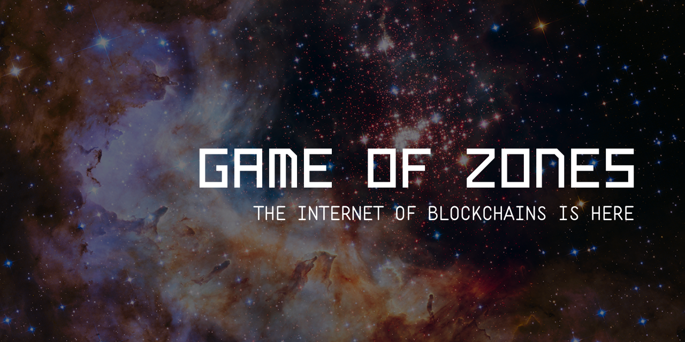

# Relayer




The Cosmos IBC `relayer` package contains a basic relayer implementation that are
meant to be used by users wishing to relay packets between sets of IBC enabled chains.
It is also well documented and intended as a place where users who are
interested in building their own relayer can come for working examples.

The team that brought you Game of Stakes will be bringing you Game of Zones this May for the Cosmos community this may.

Learn more about [Game of Zones](https://goz.cosmosnetwork.dev/).

The best place for questions is [gameofzones@cosmosnetwork.dev](mailto:gameofzones@cosmosnetwork.dev) regarding Game of Zones and prepratory testnets.

## Code of Conduct

The iqlusion team is dedicated to providing an inclusive and harrassment free experience for contributors. Please visit [Code of Conduct](CODE_OF_CONDUCT.md) for more information.

## Testnet

If you would like to join the relayer testnet, please [check out the instructions](./testnets/README.md).

### Compatability Table:

| chain | tests | supported ports |
|-------|--------|----------------|
| [`gaia`](https://github.com/cosmos/gaia) |  | `transfer` |
| `microtick` |  | `transfer` |
| [`rocketzone`](https://github.com/rocket-protocol/rocketzone) |  | `transfer` |

## Demoing the Relayer


While the relayer is under active development, it is meant primarily as a learning tool to better understand the Inter-Blockchain Communication (IBC) protocol. In that vein, the following demo demonstrates the core functionality which will remain even after the changes:

```bash
# ensure go is installed and GOPATH, GOBIN are set appropriately and GOBIN is in your PATH
# Documentation: https://golang.org/doc/install

# two-chainz creates two gaia-based chains with data directories in this
$ ./scripts/two-chainz
# NOTE: If you want to stop the two gaia-based chains running in the background use `killall gaiad`

# Make the relayer binary (rly)
$ make install

# First initialize your configuration for the relayer
$ rly config init

# NOTE: you may want to look at the config between these steps to see
# what is added in each step. The config is located at ~/.relayer/config/config.yaml
$ cat ~/.relayer/config/config.yaml

# Then add the chains and paths that you will need to work with the
# gaia chains spun up by the two-chains script
$ rly cfg add-dir configs/demo/

# NOTE: you may want to look at the config between these steps
$ cat ~/.relayer/config/config.yaml

# Now, add the key seeds from each chain to the relayer to give it funds to work with
$ rly keys restore ibc0 testkey "$(jq -r '.secret' data/ibc0/n0/gaiacli/key_seed.json)"
$ rly keys restore ibc1 testkey "$(jq -r '.secret' data/ibc1/n0/gaiacli/key_seed.json)"

# Then its time to initialize the relayer's lite clients for each chain
# All data moving forward is validated by these lite clients.
$ rly lite init ibc0 -f
$ rly lite init ibc1 -f

# At this point the relayer --home directory is ready for normal operations between
# ibc0 and ibc1. Looking at the folder structure of the relayer at this point is helpful
$ tree ~/.relayer

# Now you can connect the two chains with one command:
$ rly tx link demo

# Check the token balances on both chains
$ rly q balance ibc0
$ rly q bal ibc1

# Then send some tokens between the chains
$ rly tx transfer ibc0 ibc1 10000n0token true $(rly keys show ibc1 testkey)

# See that the transfer has completed
$ rly q bal ibc0
$ rly q bal ibc1

# Send the tokens back to the account on ibc0
$ rly tx xfer ibc1 ibc0 10000n0token false $(rly keys show ibc0 testkey)

# See that the return trip has completed
$ rly q bal ibc0
$ rly q bal ibc1

# NOTE: you will see the stake balances decreasing on each chain. This is to pay for fees
# You can change the amount of fees you are paying on each chain in the configuration.
```

## Next items

- [ ] Path negotiation reuse commands
- [x] Integration test framework: additional tests
- [x] Integration test framework: additional chains
- [x] Less lite client database access, concurrent header map
- [x] Exponential backoff queries for proofs

## Setting up Developer Environment

Working with the relayer can frequently involve working with local developement branches of `gaia`, `cosmos-sdk` and the `relayer`. To setup your environment to point at the local versions of the code and reduce the amount of time in your read-eval-print loops try the following:

1. Set `replace github.com/cosmos/cosmos-sdk => /path/to/local/github.com/comsos/cosmos-sdk` at the end of the `go.mod` files for the `relayer` and `gaia`. This will force building from the local version of the `cosmos-sdk` when running the `./dev-env` script.
2. After `./dev-env` has run, you can use `go run main.go` for any relayer commands you are working on. This allows you make changes and immediately test them as long as there are no server side changes.
3. If you make changes in `cosmos-sdk` that need to be reflected server-side, be sure to re-run `./two-chainz`.
4. If you need to work off of a `gaia` branch other than `master`, change the branch name at the top of the `./two-chainz` script.
