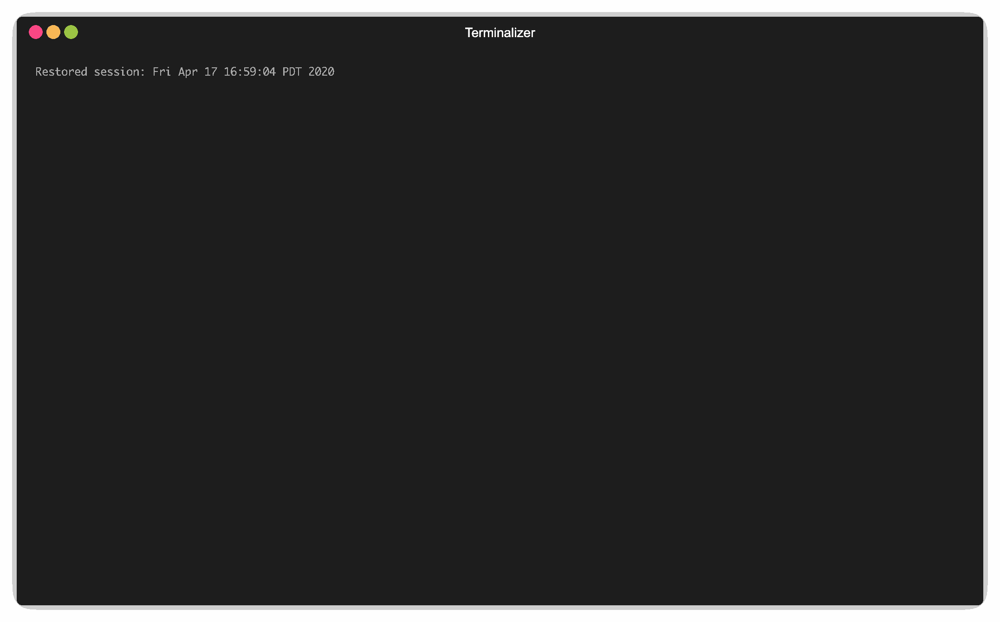

# Demo



>logging in Relayer has changed since this gifs creation

While the relayer is under active development, it is meant primarily as a learning
tool to better understand the Inter-Blockchain Communication (IBC) protocol. In
that vein, the following demo demonstrates the core functionality which will
remain even after the changes:

```bash
# ensure go and jq are installed 
# Go Documentation: https://golang.org/doc/install
# jq Documentation: https://stedolan.github.io/jq/download

# First, download and build the gaia source code so we have a working blockchain to test against
$ make get-gaia build-gaia

# two-chainz creates two gaia-based chains with data directories in this repo
# it also builds and configures the relayer for operations with those chains
$ ./examples/demo/scripts/two-chainz 
# NOTE: If you want to stop the two gaia-based chains running in the background use `killall gaiad`

# At this point the relayer --home directory is ready for normal operations between
# ibc-0 and ibc-1. Looking at the folder structure of the relayer at this point is helpful
# NOTE: to install tree try `brew install tree` on mac or `apt install tree` on linux
$ tree ~/.relayer

# See if the chains are ready to relay over
$ rly chains list

# See the current status of the path you will relay over
$ rly paths list

# Now you can connect the two chains with one command:
$ rly tx link demo -d -t 3s

# Check the token balances on both chains
$ rly q balance ibc-0
$ rly q bal ibc-1

# Then send some tokens between the chains
$ rly tx transfer ibc-0 ibc-1 1000000samoleans $(rly chains address ibc-1) channel-0

# Relay packets/acknowledgments. 
# Running `rly start demo` essentially loops these two commands
$ rly tx relay-pkts demo channel-0 -d
$ rly tx relay-acks demo channel-0 -d

# See that the transfer has completed
$ rly q bal ibc-0
$ rly q bal ibc-1

# Send the tokens back to the account on ibc-0
$ rly tx transfer ibc-1 ibc-0 1000000ibc/27A6394C3F9FF9C9DCF5DFFADF9BB5FE9A37C7E92B006199894CF1824DF9AC7C $(rly chains addr ibc-0) channel-0
$ rly tx relay-pkts demo channel-0 -d
$ rly tx relay-acks demo channel-0 -d

# See that the return trip has completed
$ rly q bal ibc-0
$ rly q bal ibc-1

# NOTE: you will see the stake balances decreasing on each chain. This is to pay for fees
# You can change the amount of fees you are paying on each chain in the configuration.
```

---

[<-- Pruning Settings](./node_pruning.md)